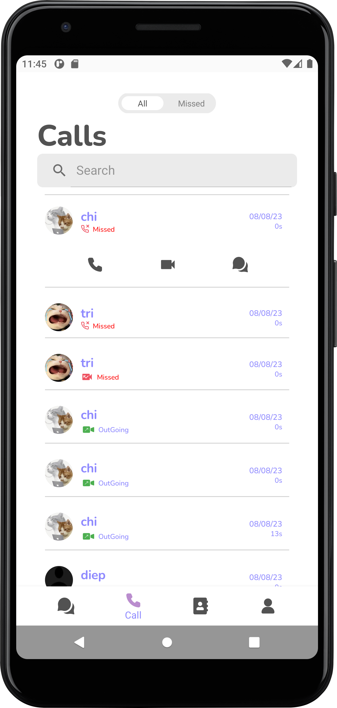

# IP Multimedia Subsystem - CSCF Project - Dfive App


The purpose of this project is to provide telecommunication users various multimedia services such
as instant messaging, voice and video calls. We will build a client application (desktop or mobile)
that requests a service and resource from a deployed IMS server by using key IMS protocols such as
SIP, SDP, RTP, H.248, DNS/ENUM and Diameter. This project use
an [open-source IMS Core System](www.openimscore.com "Openimscore") for server side and use Java as
programming language for developing the client application.

## Table of contents

- [Overview](#overview)
    - [Introduction](#introduction)
    - [Screenshot](#screenshot)
    - [Built with](#built-with)
- [Getting started](#getting-started)
    - [Prerequisites](#prerequisites)
    - [Installation](#installation)
- [Usage](#usage)
- [Deep Dive](#deep-dive)
    - [Server deployment](#server-deployment)
    - [Login](#login)
    - [Chat](#chat)
        - [Chat History](#chat-history)
        - [Personal Chat](#personal-chat)
        - [Group Chat](#group-chat)
        - [Sent Image & Emoji in Chat](#sent-image-&-emoji-in-chat)
    - [Contact](#contact)
    - [Call](#call)
- [Author](#author)

## Overview

### Introduction

In the Dfive app, users can:

- Log in to their accounts
- Make friends with other people
- Start a conversation with them
- Create a group chat with some of their friends
- Make both voice and video calls
- Change the language of the application
- Switch light mode and dark mode


### Built with

- We choose Java as our programming language to develop the app, and the IDE used
is [Android Studio](https://developer.android.com/studio?gclid=Cj0KCQjwgO2XBhCaARIsANrW2X2vezwQjTkdP0ZOmyxz9i9TH_5CFluMJX4bE80GD3TrnNWYEvakeAgaAoFJEALw_wcB&gclsrc=aw.ds)
. Kamailio is also used to deploy IMS nodes on the Server.
- Database using PostgreSQL

## Getting started

### Prerequisites

You should have already
installed [Android Studio](https://developer.android.com/studio?gclid=Cj0KCQjwgO2XBhCaARIsANrW2X2vezwQjTkdP0ZOmyxz9i9TH_5CFluMJX4bE80GD3TrnNWYEvakeAgaAoFJEALw_wcB&gclsrc=aw.ds)
on your computer.

### Installation

1. Clone the repo

2. Open the repo on Android Studio.

## Usage

1. Use your SIP account to log in to the app. If you don't have
   any, [linphone](https://subscribe.linphone.org/ "Create Linphone account") provides services to
   create your own one for free.

2. After logging in, you can freely experience which features you want. The next topic will include
   information on each feature in depth.

3. Run these commands to start the IMS nodes, presence server and FHoSS HSS-Server (assume that you have already logged in to the server):

    ```sh
    cd FHoSS/deploy/startup.sh
    /usr/local/kamailio-5.1/sbin/kamailio -f /usr/local/etc/kamailio_scscf/kamailio.cfg -P /var/run/kamailio_scscf/kamailio_scscf.pid -m 64 -M 8 -u kamailio -g kamailio
    /usr/local/kamailio-5.1/sbin/kamailio -f /usr/local/etc/kamailio_pcscf/kamailio.cfg -P /var/run/kamailio_pcscf/kamailio_pcscf.pid -m 64 -M 8 -u kamailio -g kamailio
    /usr/local/kamailio-5.1/sbin/kamailio -f /usr/local/etc/kamailio_icscf/kamailio.cfg -P /var/run/kamailio_icscf/kamailio_icscf.pid -m 64 -M 8 -u kamailio -g kamailio
    ```

## Deep Dive

### Server deployment

Please follow kamailio guide for creating, configuring P-CSCF, I-CSCF, S-CSCF and FHoSS HSS-Server. Details of their configuration files can be found both in the remote repository of our application and in the offical repository of kamailio. In general, they are functioning correctly now.

For the S-CSCF node, we modified and added some lines of code in the REGISTER route so that it can only accept REGISTER request with expiration time between 3600 - 14400 seconds:
- If the expire time of the client sent to the server is less than 3600 seconds, the server will assign the expire time to the client to be 3600 seconds
- If the expire time of the client sent to the server is greater than 14400 seconds, the server will set the expire time for the client to be 14400 seconds

### Login

We created `LinphoneService.java` file only for handling user login and logout. We used it as an API.

The `login` method below will authenticate the user input.


While the `unregister` method logs the user out.


Furthermore, we have the method that can store the users information and
will automatically log them in the next time **Dfive app** runs so that they won't be asked about
authentication again.

### Chat

#### Chat History

After logging in, the first layout to appear is the **Chat History** screen.


#### Personal Chat
Users can head to this layout by clicking item from **Chat History** or from 
**Contact** (will be talked more details in the next section).


This is the chat user's details screen


#### Group Chat

To create a group chat, click on the `plus sign button` at the top right corner of **Chat History**.


After successfully creating the group, we can join the group to chat with other members.


Here we can see the group's detail screen


Groups can only be created when adding 2 or more members, and if the group name is blank, the application will display the names of the group members.

We designed the group chat similarly to **Personal Chat** in both **Frontend** and **Backend** way. So
there are rarely any differences between them.

**In the group chat**, admin group can **remove** users from **the group**.


**In the group chat**, all members can **add** new users to **the group**.


After adding a member successfully, the newly added member can join the chat.


Also in the group chat we can change the name of the group chat


#### Sent Image & Emoji in Chat

In personal and group messaging **emoji** and **photos** can be sent, and conversation participants can **download pictures** to their devices.

Sent **emoji** in chat.


Sent **picture** in chat.


Conversation participants can download photos to the device.


### Contact

In the **Contact** page, click on the `plus sign button` at the top right corner to add new contact.


After successfully added, they can see the contact list


After adding new friends, the user can directly chat and call them by simply pressing on the appropriate button


Also, the `Delete Contact` button at the bottom gives the user the ability to delete a friend's contact.

### Call

#### Call History
After logging in, the first layout to appear is the **Call History** screen.



This is screen call missed 


#### Voice Call
This is screen `inComingCall` after an incoming voice call


After 2 users accept the voice call, the `voice call` screen is as follows


#### Video Call
This is screen `inVideoComingCall` after an incoming video call


After 2 users accept the video call, the `video call` screen is as follows


## Author

**Team Dfive - DEK Technologies Intern Season 36**

- Ngô Xuân Chiến
- Trần Huỳnh Ngọc Diệp
- Huỳnh Anh Dự
- Hoàng Thị Minh Khuê
- Dương Minh Hiếu
- Lê Thuý Nga
- Lương Thiện Trí
